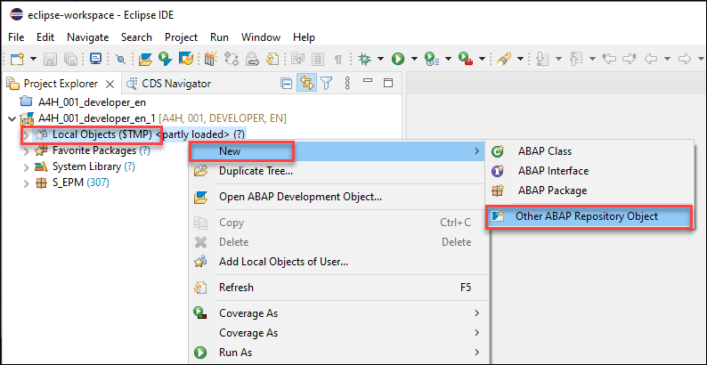
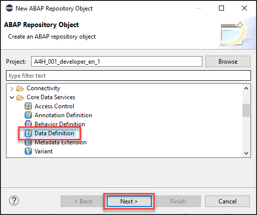
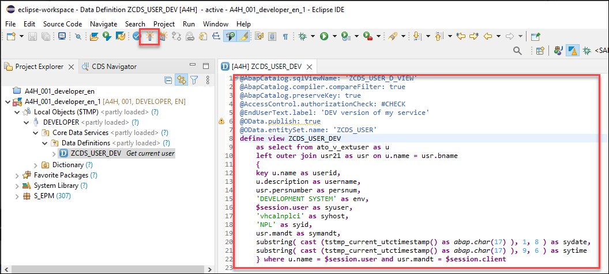
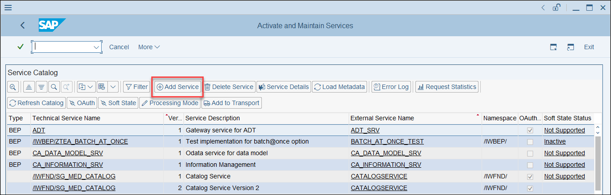
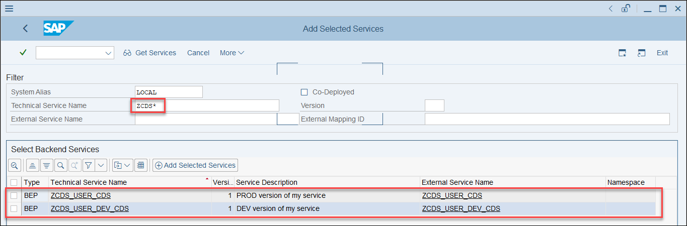
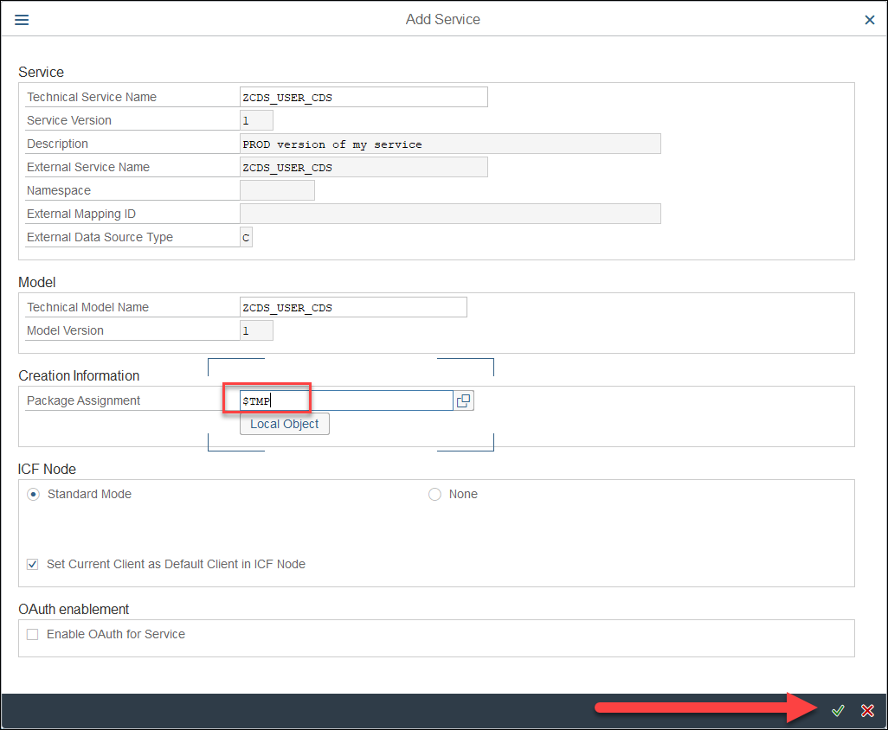
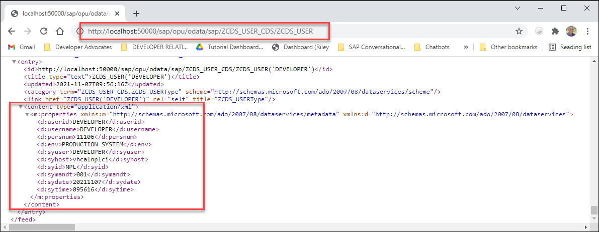

## Prerequisites
- You have set up the SAP ABAP Platform 1909, Developer Edition as described on [Docker](https://hub.docker.com/_/sap-abap-trial/plans/ac8a4f9b-ae29-4afa-9b39-25aeea24b821?tab=instructions).
- You have set up Eclipse with ABAP Development Tools (ADT) and a project to your A4H Developer Edition system, as described in [Getting Started with ABAP Development - Part&nbsp;1](https://www.youtube.com/watch?v=gRCg9mj0NaQ) and [Getting Started with ABAP Development - Part&nbsp;2](https://www.youtube.com/watch?v=4M1ieJgaRwA).
- You have access to an SAP Conversational AI Enterprise Edition in a paid SAP Business Technology Platform account.


## Details
### You will learn
- How to create CDS views
- How to expose CDS views as OData Services

SAP Conversational AI lets you make API calls within the chatbot flow. In an SAP scenario, you will likely want to call S/4HANA or other ABAP OData services to return business information to your user.

As examples of such ABAP OData services, you will create 2 similar ABAP CDS views and OData services. Both services will have the same host and entity set name, but different service paths.

Later on, in order to demonstrate the system alias feature, one of these services will represent a "development" service and the other a "production" service.

>To do this tutorial, you use the **ABAP Developer Edition**. See the prerequisites for setting this up, which make take a little bit of time.

>If you have access to your own services or have your own ABAP system, you can use those.

---

[ACCORDION-BEGIN [Step 1: ](Create the "development" service)]
1. In your ABAP Developer Edition project in Eclipse, right-click your **Local Objects ($TMP)** package, and select **New > Other Repository Objects**.

    

2. Select **Core Data Services > Data Definition** and click **Next**.

    

    Enter the following:

    |  Field Name     | Value
    |  :------------- | :-------------
    |  Name           | **`ZCDS_USER_DEV`**
    |  Description    | **`Get current user`**

    Click **Finish**.


3. In the CDS view, replace all the code with the following:

    ```CDS
    @AbapCatalog.sqlViewName: 'ZCDS_USER_D_VIEW'
    @AbapCatalog.compiler.compareFilter: true
    @AbapCatalog.preserveKey: true
    @AccessControl.authorizationCheck: #CHECK
    @EndUserText.label: 'DEV version of my service'
    @OData.publish: true
    @OData.entitySet.name: 'ZCDS_USER'
    define view ZCDS_USER_DEV
        as select from ato_v_extuser as u
        left outer join usr21 as usr on u.name = usr.bname
        {
        key u.name as userid,
        u.description as username,
        usr.persnumber as persnum,
        'DEVELOPMENT SYSTEM' as env,
        $session.user as syuser,
        'vhcalnplci' as syhost,
        'NPL' as syid,
        usr.mandt as symandt,
        substring( cast (tstmp_current_utctimestamp() as abap.char(17) ), 1, 8 ) as sydate,
        substring( cast (tstmp_current_utctimestamp() as abap.char(17) ), 9, 6 ) as sytime
        } where u.name = $session.user and usr.mandt = $session.client
    ```

    We set the `env` to return `DEVELOPMENT SYSTEM` so you will be able to tell that the data is coming from the "development" system.

    >Also notice we added the following annotations:

    >- `@OData.publish` so that the CDS view will be exposed as an OData service.
    >
    >- `@OData.entitySet.name` so that both the "development" and "production" services have the same entity set name. The entity set name is the name of the CDS view, but you cannot have two views with the same name.

4. Activate the view.

    

[DONE]
[ACCORDION-END]

[ACCORDION-BEGIN [Step 2: ](Create the "production" service)]
You will create a second service with the same entity set name.

1. Right-click your **Local Objects ($TMP)** package, and select **New > Other Repository Objects**.

2. Select **Core Data Services > Data Definition** and click **Next**.

    Enter the following:

    |  Field Name     | Value
    |  :------------- | :-------------
    |  Name           | **`ZCDS_USER`**
    |  Description    | **`Get current user`**

    Click **Finish**.

3. In the CDS view, replace all the code with the following:

    ```CDS
    @AbapCatalog.sqlViewName: 'ZCDS_USER_VIEW'
    @AbapCatalog.compiler.compareFilter: true
    @AbapCatalog.preserveKey: true
    @AccessControl.authorizationCheck: #CHECK
    @EndUserText.label: 'PROD version of my service'
    @OData.publish: true
    define view ZCDS_USER
        as select from ato_v_extuser as u
        left outer join usr21 as usr on u.name = usr.bname
        {
        key u.name as userid,
        u.description as username,
        usr.persnumber as persnum,
        'PRODUCTION SYSTEM' as env,
        $session.user as syuser,
        'vhcalnplci' as syhost,
        'NPL' as syid,
        usr.mandt as symandt,
        substring( cast (tstmp_current_utctimestamp() as abap.char(17) ), 1, 8 ) as sydate,
        substring( cast (tstmp_current_utctimestamp() as abap.char(17) ), 9, 6 ) as sytime
        } where u.name = $session.user and usr.mandt = $session.client
    ```

    Here we set the `env` to return `PRODUCTION SYSTEM` so you will be able to tell that the data is coming from the "production" system.

4. Activate the view.

[DONE]
[ACCORDION-END]
[ACCORDION-BEGIN [Step 3: ](Expose the OData services)]
1. Open your developer edition in SAP GUI.

2. Run transaction `/IWFND/MAINT_SERVICE` (Activate and Maintain Services).

3. Click **Add Service**.

    

4. Search for your services (e.g., for **Technical Service Name**, enter `ZCDS*` and press **Enter**).

    

5. For each service:

    Open the service, make sure the service has a package (e.g., `$TMP`), and click **Enter**.

    

You should now be able to call the services with a URL in the format (you will have to log in):

```URL
http://<your host>:50000/sap/opu/odata/sap/<View Name>_CDS/ZCDS_USER
```

The view name is the name entered in the `define view` statement in the CDS code.



[DONE]
[ACCORDION-END]


---
