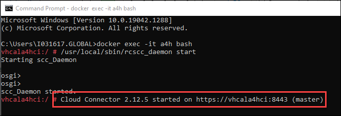
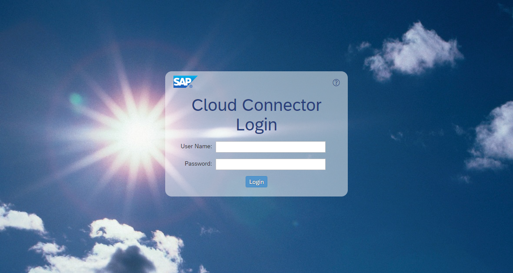
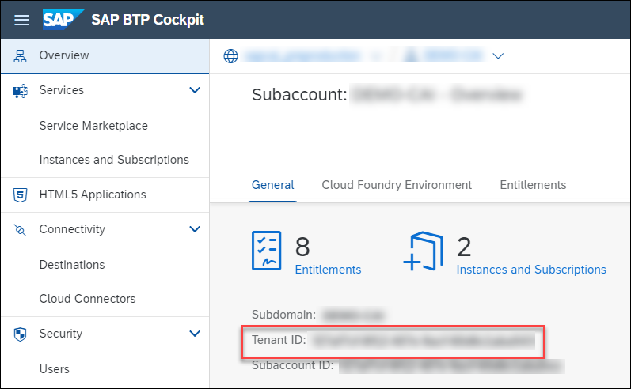
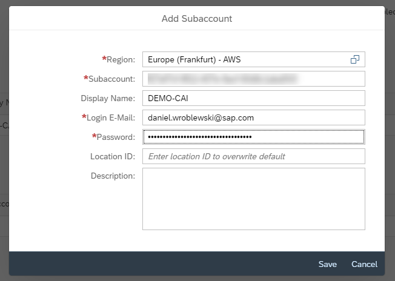
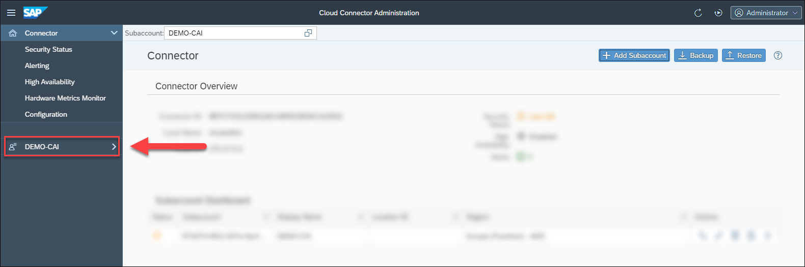
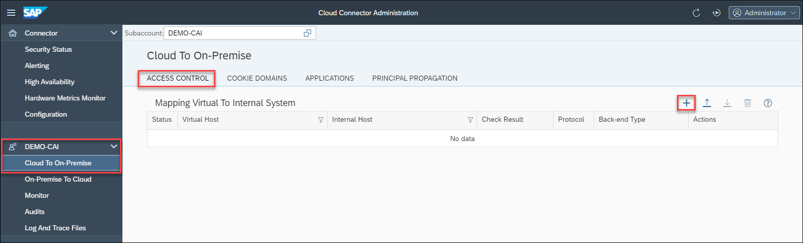

## Prerequisites

## Details
### You will learn
- How to create CDS views
- How to expose CDS views as OData Services

A cloud connector comes pre-installed in the ABAP Developer Edition, so that you can expose what you create to the cloud, especially to SAP Business Technology Platform, where our SAP Conversational AI Enterprise Edition instance resides.

Our chatbot in the SAP Conversational AI Enterprise Edition will want to call the OData services from our CDS views within our ABAP Developer Edition on-premise system (i.e., that is, on our laptop).   

---

[ACCORDION-BEGIN [Step 1: ](Start the cloud connector)]

1. Open a command prompt and run the following:

    ```Shell
    docker exec -it a4h bash
    ```

2. Now run the following:

    ```Shell
    /usr/local/sbin/rcscc_daemon start
    ```
It may take a few minutes for the cloud conector to start. You will get a message when it starts:



When it is ready, go to the following URL to open the browser interface:

```
https://localhost:8443/
```




[DONE]
[ACCORDION-END]

[ACCORDION-BEGIN [Step 2: ](Log into cloud connector)]
Log into the cloud connector.

>Out of the box, the user is `Administrator` and password is `manage`. You will have to change this after your first login.

[DONE]
[ACCORDION-END]
[ACCORDION-BEGIN [Step 3: ](Add subaccount to cloud connector)]
You will now specify the SAP BTP subaccount to which you want to expose your on-premise system.

1. Click **Add Subaccount**.

2. Fill out the subaccount details.

    >You will need the subaccount ID (not name), which you can find on the subaccount **Overview** page.

    >    

    You will have to be an administrator in the subaccount.

    

    >If you have 2-factor authentication enabled for your SAP ID account, you will have to append your token to your password.

3. Click **Save**.

Your subaccount will be added to the left menu.




[DONE]
[ACCORDION-END]
[ACCORDION-BEGIN [Step 4: ](Add system mapping)]
1. On the menu, click your subaccount, and then select **Cloud to On-Premise**.

    

2. In the **Access Control** tab, click the **+** sign next to **Mapping Virtual to Internal System**.

2. Go through the wizard and fill out the following details:

    |  Field Name     | Value
    |  :------------- | :-------------
    |  Back-end Type           | **`ABAP System`**
    |  Protocol           | **`HTTP`**
    |  Internal Host    | **`127.0.0.1`**
    |  Internal Port          | **`50000`**
    |  Virtual Host    |  `mydevedition`
    |  Virtual Port | **`50000`**

    Fill the other fields with the defaults, and at the end, click **Finish**.

3. Select your system mapping, and then click the **+** sign to add a resource.

    Fill in the following:

    |  Field Name     | Value
    |  :------------- | :-------------
    |  URL Path           | **`/`**
    |  Access Policy           | **`Path and All Sub-Paths`**

    >You can make the resource more restrictive.

    Click **Save**.

[DONE]
[ACCORDION-END]

[ACCORDION-BEGIN [Step 5: ](Test yourself)]

[VALIDATE_6]
[ACCORDION-END]


---
