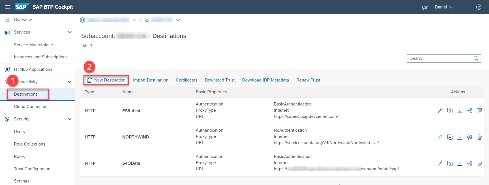
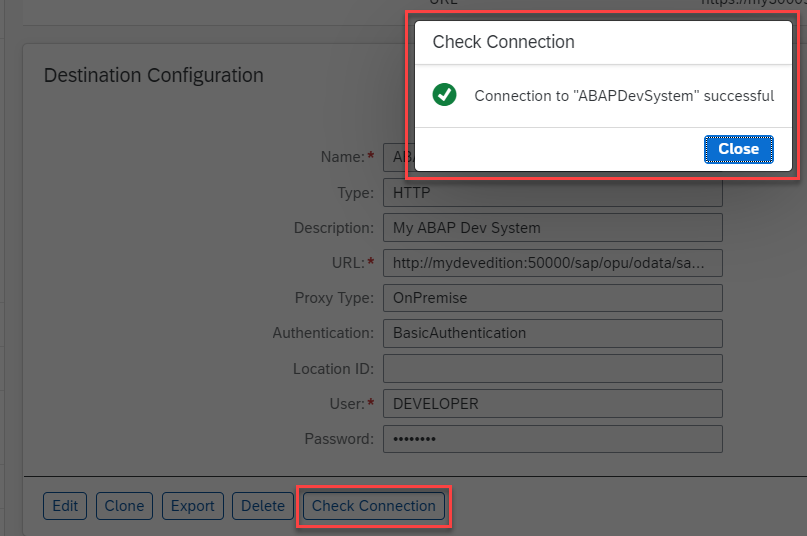
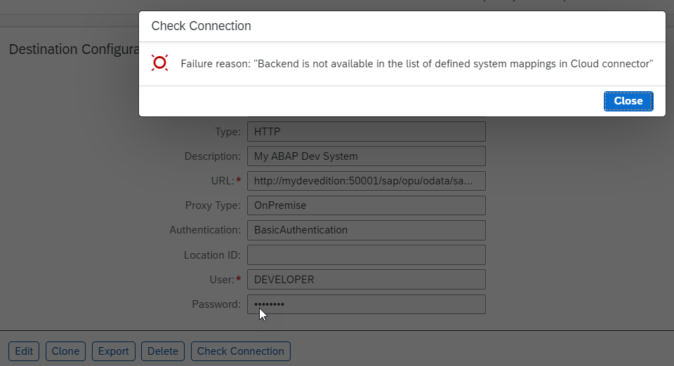

## Prerequisites

## Details
### You will learn
- How to create destinations for on-premise ABAP OData services

In this tutorial, you will create destinations in SAP BTP so that your chatbot (running in that SAP BTP subaccount) can call your OData services in your ABAP Developer Edition.

You will need the following:

- **Virtual Host:** You will point to your ABAP Developer Edition using the virtual host name defined in the SAP Cloud Connector, in this case, `mydevedition`.

- **User and Password:**  For this tutorial, use the `DEVELOPER` user provided when you installed the ABAP Developer Edition.

---

[ACCORDION-BEGIN [Step 1: ](Create destination for developer system)]

1. In your subaccount, go to **Destinations** and click **New Destination**.

    

2. Set the following fields:

    |  Field Name     | Value
    |  :------------- | :-------------
    |  Name           | **`ABAPDevSystem`**
    |  Type           | **`HTTP`**
    |  Description    | **`My ABAP Dev System`**
    |  URL          | **`http://mydevedition:50000/sap/opu/odata/sap/ZCDS_USER_DEV_CDS`**
    |  Proxy Type   | **`On Premise`**
    |  Authentication | **`Basic Authentication`**
    |  User | Your user in the ABAP Developer Edition
    |  Password | Your password

3. Click **Save**.

4. Click **Check Connection**, and you should get a success message.

    This only means that SAP BTP could reach the server, but does not necessarily mean the full path is OK or even the user/password is correct.

    

    If something is not configured correctly (e.g., bad configuration of SAP Cloud Connector, bad host name), you will get a message like this:

    

>In a productive scenario, your destination would generally point just to a host, without the path details. But in this tutorial, since we had only one server but wanted to create a "development" and "production" environment, we set the destinations to point to the same server but different OData services.

[DONE]
[ACCORDION-END]

[ACCORDION-BEGIN [Step 1: ](Create destination for production system)]

1. In your subaccount, go to **Destinations** and click **New Destination**.

    

2. Set the following fields:

    |  Field Name     | Value
    |  :------------- | :-------------
    |  Name           | **`ABAPProdSystem`**
    |  Type           | **`HTTP`**
    |  Description    | **`My ABAP Dev System`**
    |  URL          | **`http://mydevedition:50000/sap/opu/odata/sap/ZCDS_USER_CDS`**
    |  Proxy Type   | **`On Premise`**
    |  Authentication | **`Basic Authentication`**
    |  User | Your user in the ABAP Developer Edition
    |  Password | Your password

3. Click **Save**.

4. Click **Check Connection** to check the connection.

[DONE]
[ACCORDION-END]

---
