## Prerequisites
- You have access to an SAP Conversational AI Enterprise Edition in a paid SAP Business Technology Platform account.
- You understand the basics of creating a chatbot, as described in the tutorial [Build Your First Chatbot with SAP Conversational AI](cai-bot-getting-started).
- You understand the basics of calling APIs from your chatbots, as described in the tutorial [Consume API Services and Call Webhooks from Your Chatbot](conversational-ai-webhook-api-call).

## Details
### You will learn
- How to create system aliases
- How to map system aliases to BTP destinations
- How to set up system aliases for development and production systems

We will use a simple chatbot -- with just the greeting skill -- to demonstrate how to call your ABAP services and set up development and production environments that use destinations but call different services.

System aliases let you define in a central place the external systems that your bot is using, and you can maintain the details (like URL and authentication) separately per environment. In system aliases in the enterprise edition, you can choose HTTP destinations maintained in SAP Business Technology Platform.

System aliases, which are reusable nicknames representing connections to external systems, can be used when configuring webhooks and API service calls.

For more information, see [System Alias Configuration](https://help.sap.com/viewer/a4522a393d2b4643812b7caadfe90c18/latest/en-US/b10d11cef47547958bd82b49e543bb1c.html?q=system%20aliases)

>**IMPORTANT:** SAP Conversational AI is not available in trial accounts of SAP Business Technology Platform, nor is there a free-tier plan.

---

[ACCORDION-BEGIN [Step 1: ](Open SAP Conversational AI)]

In your subaccount, go to **Instances and Subscriptions**, and click the SAP Conversational AI instance.

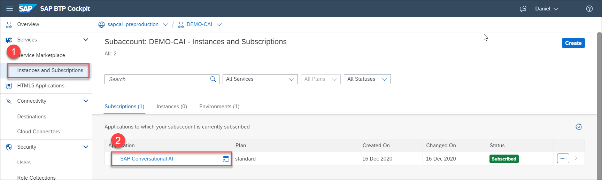

>You can access the service directly with a URL in the form:

>`https://<subaccount>.<global acount>.sapcai.<region>.hana.ondemand.com/`


[DONE]
[ACCORDION-END]

[ACCORDION-BEGIN [Step 2: ](Create a simple chatbot)]

1. Sign into SAP Conversational AI, and click **New Bot**.

2. Fill in the following:

      - Select **Perform Actions**.

      - For the predefined skills, choose **Greetings**.

      - In the **Create your bot** section, enter the following:

        |  Field Name     | Value
        |  :------------- | :-------------
        |  Bot name       | **`test-abap-services`**
        |  Description    | **A bot to test development and production services.**

      - For **Data Policy**, select the following:

        - **Non-personal**.

        - **Store**.

        - **Non-vulnerable**.

      - For **Bot visibility**, select **Private**.

      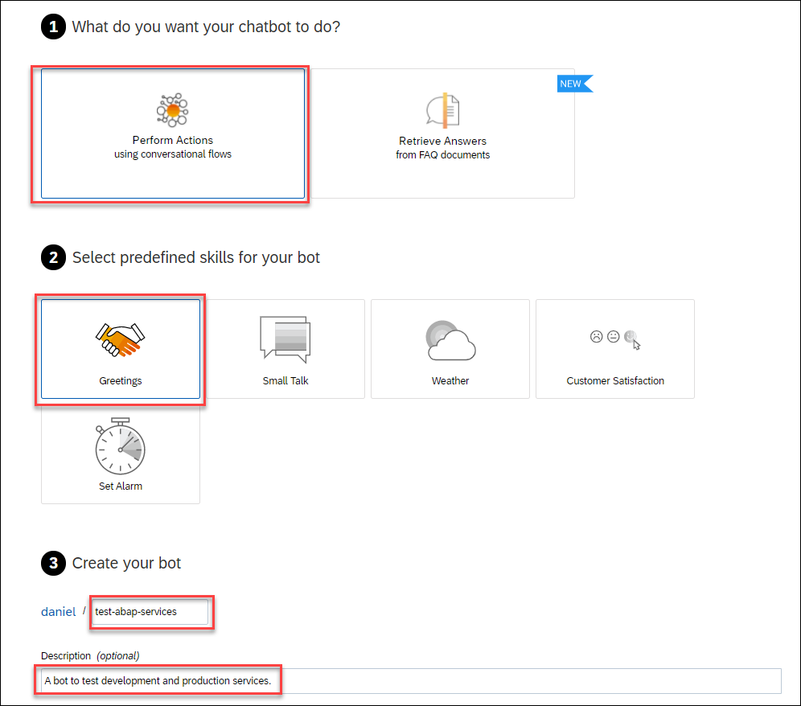

3. Click **Create a bot**.


[DONE]
[ACCORDION-END]
[ACCORDION-BEGIN [Step 3: ](Enable system aliases)]

1. Click **Settings**.

    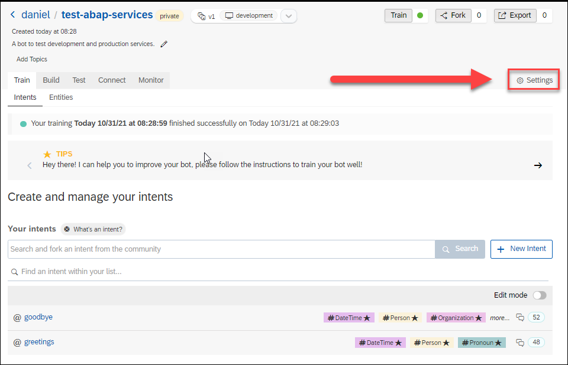

2. Click **System Aliases**, and then click **Enable**.

    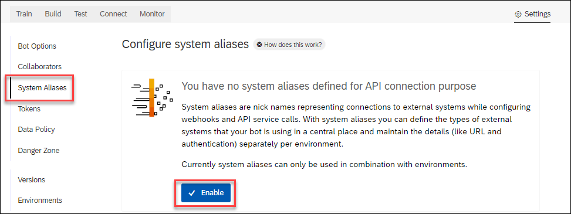

    Click **Confirm** in the confirmation dialog.

3. Click **New Alias**, type in `MyABAPAlias`, and press **Enter**.

    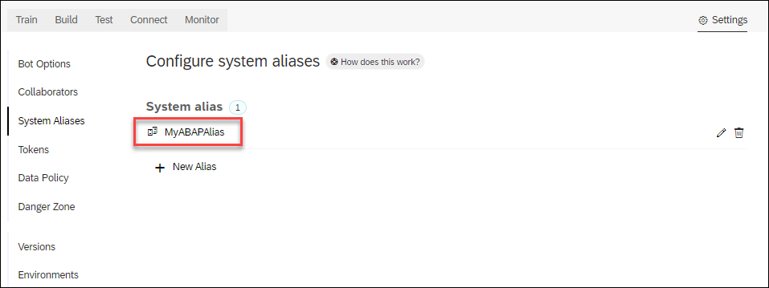

[DONE]
[ACCORDION-END]

[ACCORDION-BEGIN [Step 4: ](Update greetings skill)]
You will now update the greetings skill to call the ABAP OData service and display some data.

1. Go to the **Build** tab and click the `greetings` skill.

    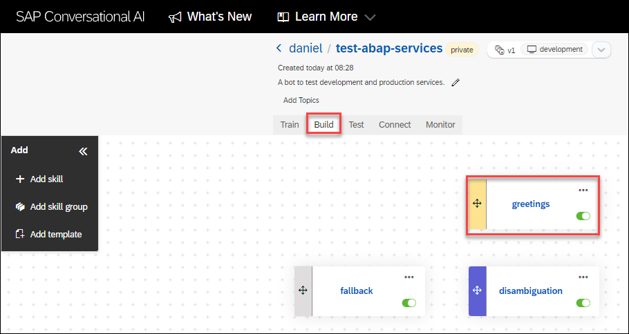

2. Go to the **Actions** tab.

3. Just after the action to print out **Hello**, click **Connect External Service > Consume API Service**.

    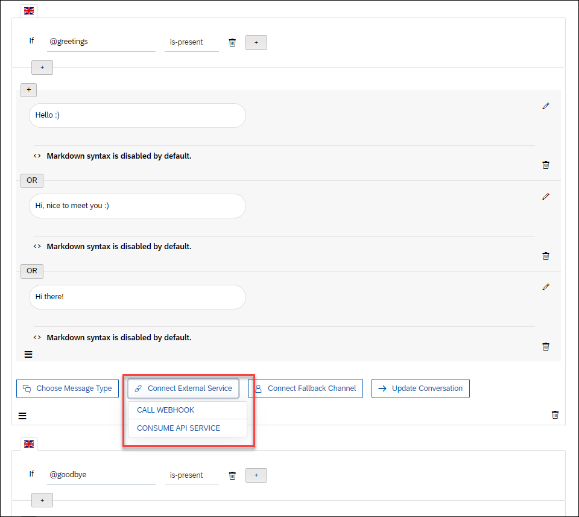

4. Configure the API call as follows:

    |  Field Name     | Value
    |  :------------- | :-------------
    |  HTTP Method           | **`GET`**
    |  System Alias           | **`MyABAPAlias`**
    |  URL Path    | **`/ZCDS_USER`**
    |  Headers          | Add `Accept: application/json`
    |  Response   | Set namespace to `abapservice`

    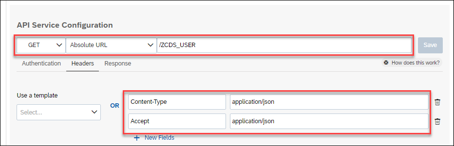

    Click **Save**.

    >Instead of the `Accept` header, you can also append `?$format=json` to the URL path.

5. Right after the API call, add a message of type **Text**, and add the following code:

    ```Message
    My ABAP Call

    USER NAME: {{ api_service_response.abapservice.body.d.results.[0].username}}

    SYSTEM: {{ api_service_response.abapservice.body.d.results.[0].env}}
    ```

    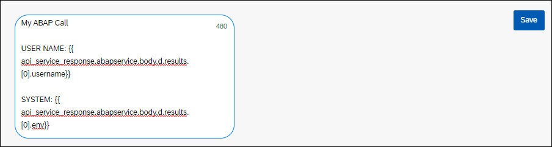

    Click **Save**.

[DONE]
[ACCORDION-END]

[ACCORDION-BEGIN [Step 5: ](Map aliases to development and production services)]
Generally, you will have different hosts for development vs. production, but here you are simulating this situation by calling 2 different services in the same host but with different starts to the path -- that is, different service names.

The key is that the 2 services have a similar entity set (i.e., `ZCDS_USER`).

1. You automatically have a development environment in your chatbot. You now need a production environment.

    Go to **Settings > Environments**, and click **New Environment**.

    Call the environment `production`, base the environment on v1, and click **Create**.

    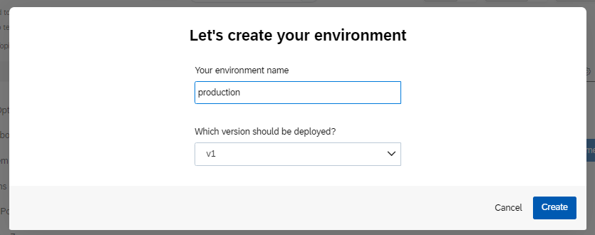

2. Open the `development` environment, and for the system alias select **Destination**, and then select the  destination to `ABAPDevSystem`.

    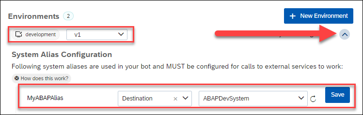

3. Open the `production` environment, and for the system alias select **Destination**, and then select the  destination to `ABAPProdSystem`.

>### What's going on?

>You created an API call to fetch the `ZCDS_USER` entity, using the `MyABAPAlias` system alias. All your calls -- development and production -- will use this alias.

>But for the development environment of your chatbot, this alias will be mapped to the "development" ABAP system, and for the production environment of your chatbot, this alias will be mapped to the "production" ABAP system.

>At this point, we have 2 SAP Conversational AI environments, both using version `v1`. Currently, the development environment is selected.  


[DONE]
[ACCORDION-END]

[ACCORDION-BEGIN [Step 6: ](Chat in development)]
At the top of the screen you can see that the current version of the bot is `v1 development`.

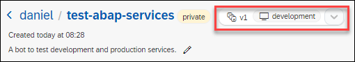

Enter `hi` in the chat, and you will get back the data for the development system, which you can see because the user name is `DEVELOPMENT SYSTEM`.

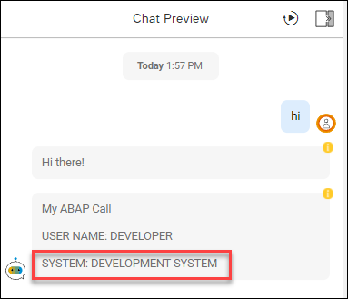

Now create a production version and chat with it.

[DONE]
[ACCORDION-END]


[ACCORDION-BEGIN [Step 7: ](Create production version)]

1. Go to **Settings > Versions**

    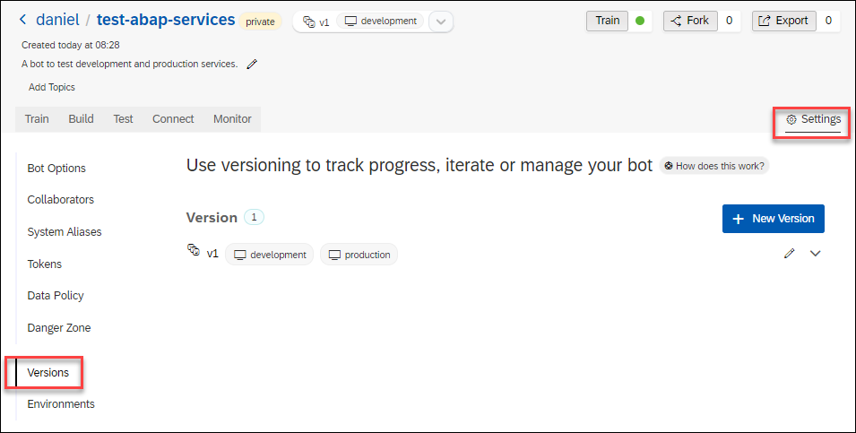

2. Click **New Version**, call the new version `v2` and based on `v1`, and click **Create**.

    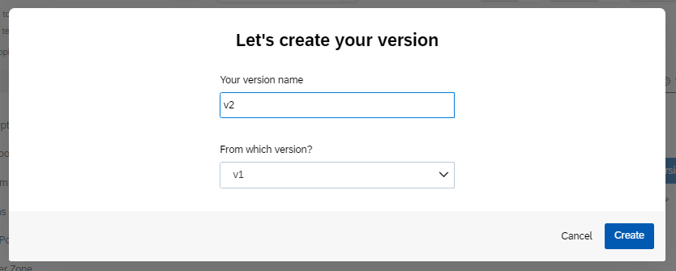

3. Click **Environments** and set the `development` environment to `v2` (keep `production` as `v1`).

    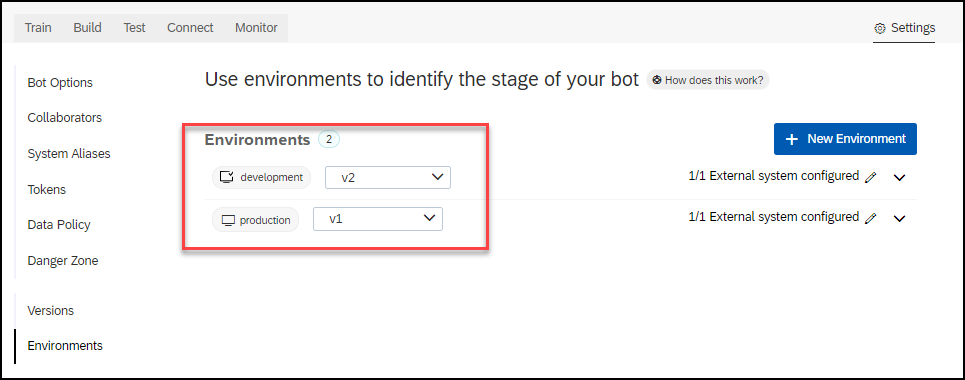

    In the confirmation dialog, click **Deploy V2**. It may take a few minutes for the version to be deployed.

4. Refresh the browser, and make sure the current version is now `v1 production`.

    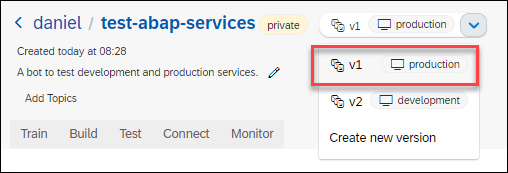

[DONE]
[ACCORDION-END]


[ACCORDION-BEGIN [Step 8: ](Chat in production)]
Go back to chat window, and enter `hi`.

This time you will get back the data for the production system, which you can see because the user name is now simply `DEVELOPER`.

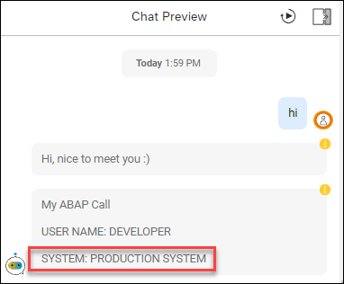

[DONE]
[ACCORDION-END]

[ACCORDION-BEGIN [Step 9: ](Test yourself)]


[VALIDATE_1]
[ACCORDION-END]

---
