## Prerequisites
- Any SAPUI5 app (feel free to build the simple SAPUI5 app described in the [2 Minutes of SAPUI5 playlist](https://www.youtube.com/watch?v=J9NMwsipMkw&list=PL6RpkC85SLQC4kuj22e4hw85Sa1pClD8y))
- An SAP Conversational AI chatbot to deploy in your SAPUI5 app (you can simply use a new one with the Greetings skill)
- Knowledge on how to deploy a chatbot to a web page with the Web Client. The tutorial [Deploy an SAP Conversational AI Chatbot on a Web Site](conversational-ai-deploy-web) describes a similar process for the Web Chat client.

## Details
### You will learn
  - How to use the Web Client APIs
  - How to use the Web Client Bridge APIs

The Web Client APIs let you control your chatbot from within your web application, including:
- Open and close the chatbot
- Send a message to the chatbot (as if it came from your user)
- Change the theme of the chatbot

The Web Client Bridge APIs let you:
- Capture the messages sent by the user and the chatbot
- Set the client info for the conversation
- Set the style and default texts
- Set up speech to text for your chatbot (this is explained in the tutorial [Add Speech-to-Text to Your Chatbot](conversational-ai-speech-2-text-simple))

>The Web Client APIs and Bridge APIs are documented in the [`SAPConversationalAI / WebClientDevGuide`](https://github.com/SAPConversationalAI/WebClientDevGuide/tree/main/examples/WebClientBridge/stt) GitHub repo.

---

[ACCORDION-BEGIN [Step 1: ](Add Web Client script)]

In your SAPUI5 view controller, in the `onAfterRendering` method, add the script tag for adding your Web Client to a web page. The script is available in the **Connect** tab when developing your chatbot.

```javascript[4-11]
onAfterRendering: function () {
  // Set up chatbot
  // this.renderCAIChatBot()
        var s = document.createElement("script");
        s.setAttribute("src", "https://cdn.cai.tools.sap/webclient/bootstrap.js");
        s.setAttribute("id", "cai-webclient-custom");
        s.setAttribute("data-expander-preferences",data_expander_preferences);
        s.setAttribute("data-channel-id",data_channel_id);
        s.setAttribute("data-token",data_token);
        s.setAttribute("data-expander-type","CAI");
        document.body.appendChild(s);
     },
```

For the specific IDs and tokens for your chatbot, place a new file `webclient.js` inside the `controller` folder (since you may want to change the chatbot from time to time) and add just the following few lines. Make sure to enter values for your chatbot.

```JavaScript[1-3]
const data_expander_preferences = "<my preferences>";
const data_channel_id = "<my channel ID>";
const data_token = "<my token>";
```

To load the file with your details, add a dependency at the start of the controller file.

```JavaScript[14,18]
sap.ui.define([
    "profilePic/controller/BaseController",
    "sap/m/MessageToast",
    "sap/m/MessageBox",
    "sap/ui/core/Core",
    "sap/ui/model/json/JSONModel",
    "sap/ui/Device",
    "sap/suite/ui/commons/library",
    "sap/m/Dialog",
    "sap/m/DialogType",
    "sap/m/Button",
    "sap/m/ButtonType",
    "sap/m/TextArea",
    "./webclient"
],
    function (BaseController, MessageToast, MessageBox, oCore, JSONModel, Device, SuiteLibrary,
        Dialog, DialogType, Button, ButtonType, TextArea,
        webclient) {
```

At this point you should already be able to use the chatbot in your app -- just without speech to text.

Run the SAPUI5 app and use your chatbot.


[DONE]
[ACCORDION-END]

[ACCORDION-BEGIN [Step 2: ](Add footer toolbar)]
Add a footer to your view so you can activate the various Web Client APIs.

Inside the `<Page>` tag after the `<content>` section, add the following `<footer>` section.

```XML
<footer>
     <Toolbar>
         <Button text="Open" type="Attention" press="onPressOpen" />
         <Button text="Close" type="Attention" press="onPressClose" />
         <Button text="Toggle" type="Emphasized" press="onPressToggle" />
         <Button text="Send" type="Attention" press="onPressMessage" />
         <Input id="messageText" placeholder="Say something ..." width="150px" change=".onNameChange" />
         <Select id="themeSelect" forceSelection="false" selectedKey="" items="{
             path: 'themes>/themes',
             sorter: { path: 'name' }
         }" change="onThemeChange">
             <core:Item key="{themes>theme}" text="{themes>name}" />
         </Select>
         <Label text="Memory:" class="sapUiTinyMarginEnd" />
         <Switch id="memoryListen" type="AcceptReject" state="" change="onChangeMemory" />
         <Label text="Message:" class="sapUiTinyMarginEnd" />
         <Switch id="messageListen" type="AcceptReject" state="" change="onChangeMessage" />
         <ToolbarSpacer />
     </Toolbar>
 </footer>
```

This now adds the following footer to your view:

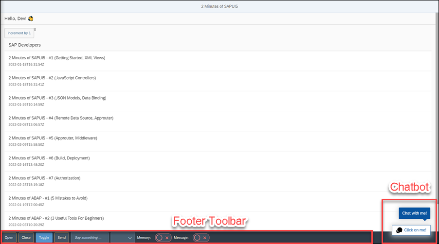

>The theme selector will be empty because you did not create a data model with all the themes. You will do this in the next step.


[DONE]
[ACCORDION-END]

[ACCORDION-BEGIN [Step 3: ](Add data model for themes)]

Put the following in the `onInit` method. This will add the theme options to the `<select>` element.


```JavaScript
var themes = {
    "themes": [
        {
            "name": "SAP Belize",
            "theme": "sap_belize"
        },
        {
            "name": "SAP Belize High Contrast Black",
            "theme": "sap_belize_hcb"
        },
        {
            "name": "SAP Belize High Contrast White",
            "theme": "sap_belize_hcw"
        },
        {
            "name": "SAP Quartz",
            "theme": "sap_fiori_3"
        },
        {
            "name": "SAP Quartz Dark",
            "theme": "sap_fiori_3_dark"
        },
        {
            "name": "SAP Quartz High Contrast White",
            "theme": "sap_fiori_3_hcw"
        },
        {
            "name": "SAP Quartz High Contrast Black",
            "theme": "sap_fiori_3_hcb"
        },
        {
            "name": "SAP Horizon",
            "theme": "sap_horizon"
        },
        {
            "name": "SAP Horizon Experimental",
            "theme": "sap_horizon_exp"
        }
    ]

};

// set explored app's demo model on this sample
var oModel = new JSONModel(themes);
this.getView().setModel(oModel, "themes");
```

You can refresh the app and now there will be theme options.

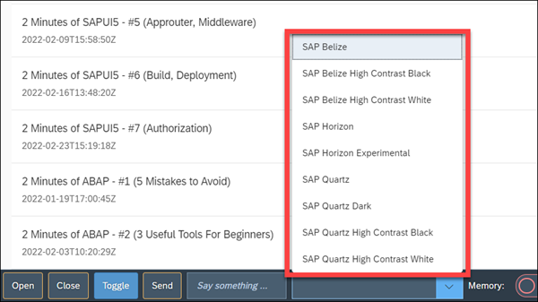

[DONE]
[ACCORDION-END]

[ACCORDION-BEGIN [Step 4: ](Add event handlers)]

In the view controller, add the following methods:

```JavaScript
// Open Web Client
onPressOpen: function (evt) {
     window.sap.cai.webclient.show();
 },
 // Close Web Client
 onPressClose: function (evt) {
     window.sap.cai.webclient.hide();
 },
 // Toggle Web Client, open or close
 onPressToggle: function (evt) {
     window.sap.cai.webclient.toggle();
 },
 // Send a message to the chatbot, as if it came from the user
 onPressMessage: function (evt) {
     var oView = this.getView(),
         myinput = oView.byId("messageText");
     window.sap.cai.webclient.sendMessage(myinput.getValue());
 },
 // Change the theme of the chatbot
 onThemeChange: function (oEvent) {
     var oView = this.getView(),
         mytheme = oView.byId("themeSelect");
     window.sap.cai.webclient.setTheme(mytheme.getSelectedKey());
 },
```

[DONE]
[ACCORDION-END]

[ACCORDION-BEGIN [Step 5: ](Try the web client APIs)]

Try out the Web Client methods.

1. Click **Open** to open the chatbot, **Close** to close the chatbot, and **Toggle** to do either.

    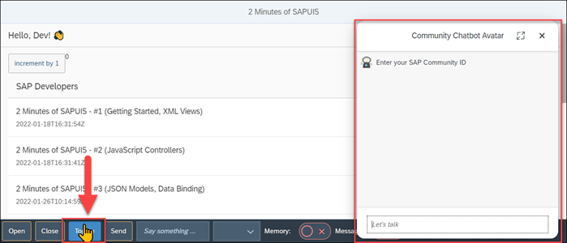

2. Enter `hi` in the text field, and then click **Send**.

    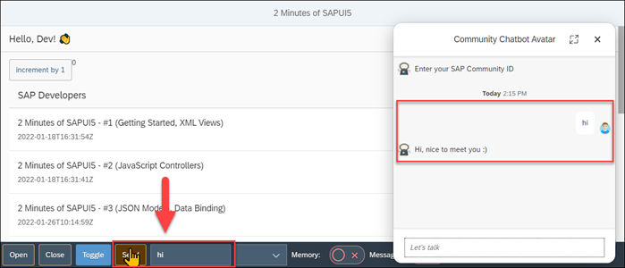

3. From the dropdown box, select **Quartz Dark**, and notice the chatbot theme changes.

    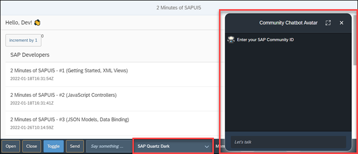

[DONE]
[ACCORDION-END]

[ACCORDION-BEGIN [Step 6: ](Set up Web Client bridge)]

Create a file called `webclientbridge.js` and add it to your `controller` folder.

Add the following code:

```JavaScript
const webclientBridge = {


}

window.sapcai = {
    webclientBridge,
}
```
Add a dependency to this file in your view controller.

```JavaScript[5,7]
sap.ui.define([
   "sap/ui/core/mvc/Controller",
   "sap/ui/model/json/JSONModel",
   "./webclient",
   "./webclientbridge"
], function (Controller, JSONModel,webclient,
    webclientbridge) {

```

In the following steps, you will add Web client listeners inside the `webclientBridge` object for various tasks.

[DONE]
[ACCORDION-END]

[ACCORDION-BEGIN [Step 7: ](Change memory)]

Add the following method to the `webclientBridge` object:

```JavaScript
// Called on every utterance
getMemory: () => {
    let memory;
    memory = { 'mynumber': 200 }
    return { memory, merge: true }
},

```

Update the chatbot to display the memory. In this chatbot, typing "my number" displays the memory variable `mynumber`, which is set to 0 in the Initialize skill.

On subsequent calls, the memory is updated from this Web Client Bridge function. The `merge` value indicates whether to wipe out the current memory or to just update the values being returned.

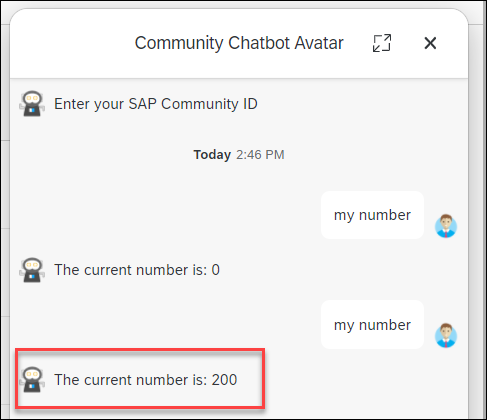


[DONE]
[ACCORDION-END]

[ACCORDION-BEGIN [Step 8: ](Capture messages)]

Add the following method to the `webclientBridge` object:

```JavaScript
// called on every message
onMessage: (payload) => {
    var displayMessage
    payload.messages.forEach(element => {
        displayMessage = ''
        if (element.participant.isBot) {
            displayMessage = "THE BOT SAID:\n\n";
        } else {
            displayMessage = "THE USER SAID:\n\n"
        }
        displayMessage += element.attachment.content.text
    });
    alert(displayMessage)
},
```

The above code will now display an alert for each message, indicating if it was sent by the user or the chatbot, and the text of the message.

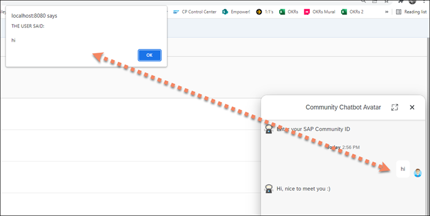

You can inspect the payload object in the method to see what other information is provided.


[DONE]
[ACCORDION-END]

[ACCORDION-BEGIN [Step 9: ](Set client info and preferences)]
The following two methods are called at the start of the conversation, and used to set the theme (including some texts) and the client information, which is accessible to the chatbot.

Add the following method to the `webclientBridge` object:

```JavaScript
// Called once when the WebClient is loaded, and sets client info
getClientInfo: (defaults) => {
    return {
        language: 'en',
        forceLanguage: false,
        timezone: 'America/Los_Angeles'
    }
},
```

If Initialize skill sets the current timezone based on the `client_info` object, you can set up a skill to display the time and the time zone used.

Here, we ask for the time at 15:05 in Jerusalem, but because we set the client info, it is displayed as 6:04 in the Los Angeles time zone.

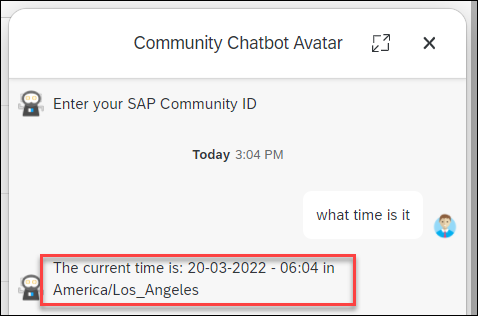

---

Add the following method to the `webclientBridge` object:

```JavaScript
// Called once when the WebClient is loaded, and sets CSS preferences
getChannelPreferences: () => {
    return {
        // all preferences to be overwritten dynamically
        accentColor: 'blue',
        botMessageBackgroundColor: '#808000',
        botMessageColor: 'green',
        complementaryColor: '#808000',
        backgroundColor: 'olive',
        headerTitle: 'Community Chatbot Avatar',
        userInputPlaceholder: "Let's talk",
        botPicture: 'https://avatars.githubusercontent.com/in/155597?s=88&v=4',
    }
}
```

The preferences let you set some of the color settings, as well as texts and icons.

>The texts and icons are always used, but the CSS colors are only used if you have set the Custom Style SHeet setting in the Web Client channel.

>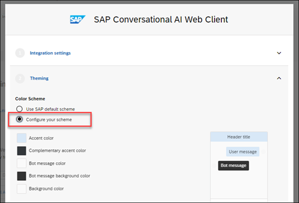
>&nbsp;

[DONE]
[ACCORDION-END]

[ACCORDION-BEGIN [Step 10: ](2 use cases)]

A use case originally created for the Web Chat was to allow a user to type into the chatbot whether to move or zoom a Google map embedded in the web app. The chatbot interprets what the user wants and sends the results as a message, and the web page intercepts that message and calls the appropriate Google API to adjust the map.

The use case is based on this blog, [How to Control Your Web Application With an Integrated AI Bot](https://blogs.sap.com/2018/12/17/how-to-control-your-web-application-with-an-integrated-ai-bot/), but only uses the Web Client `onMessage` callback.

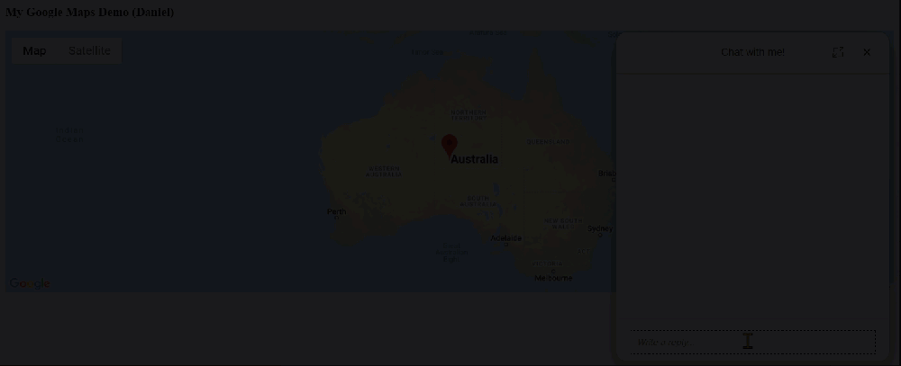

Another use case was with the recent [SAP Community Coding Challenge](https://blogs.sap.com/2022/03/02/adding-a-chatbot-to-the-sap-community-code-challenge/). A user indicates they want to download their Avatar into the SAPUI5 Image Editor, gives a community ID, and web app intercepts the message and loads the avatar.

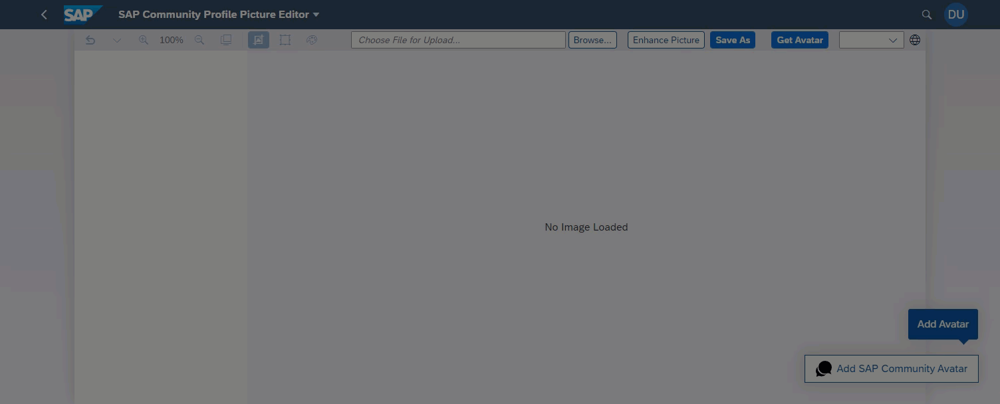


[VALIDATE_7]
[ACCORDION-END]

---
