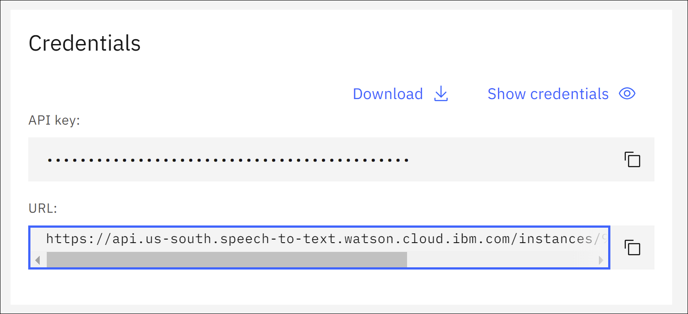
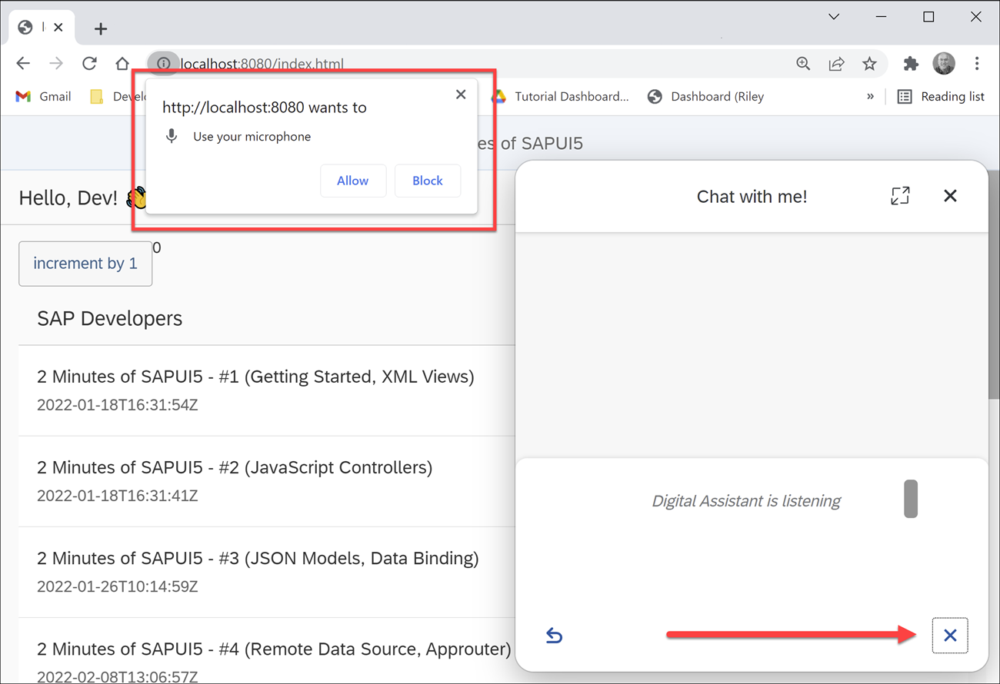
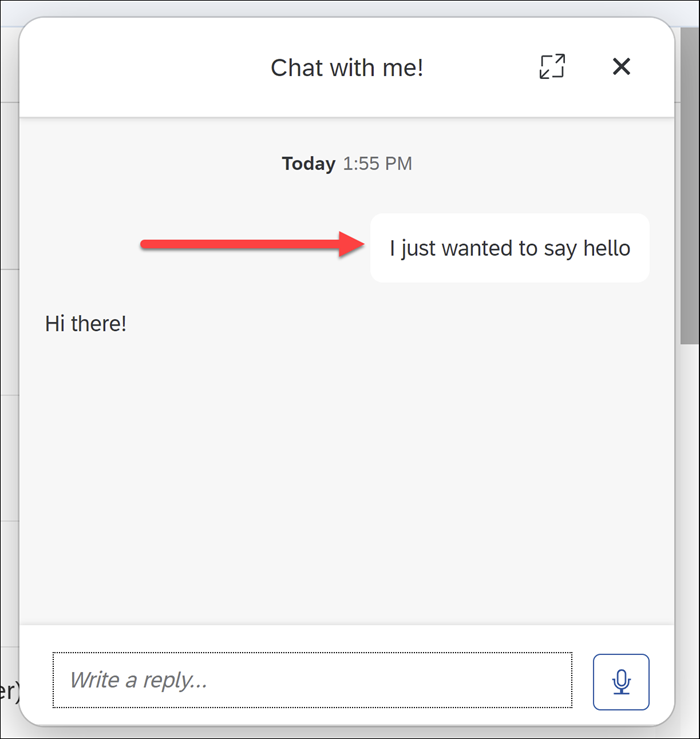

# Add Speech-to-Text to Your Chatbot (with recorder)
<!-- description --> Let users talk with your SAP Conversational AI chatbot inside an SAPUI5 app using the speech-to-text APIs of the Web Client bridge, including the media recorder feature, and an external speech-to-text service.

## Prerequisites
 - Any SAPUI5 app (feel free to build the simple SAPUI5 app described in the [2 Minutes of SAPUI5 playlist](https://www.youtube.com/watch?v=J9NMwsipMkw&list=PL6RpkC85SLQC4kuj22e4hw85Sa1pClD8y))
 - An SAP Conversational AI chatbot to deploy in your SAPUI5 app (you can simply use a new one with the Greetings skill)
 - Knowledge on how to deploy a chatbot to a web page with the Web Client. The tutorial [Deploy an SAP Conversational AI Chatbot on a Web Site](conversational-ai-deploy-web) describes a similar process for the Web Chat client.
 - An account with [IBM Cloud](https://cloud.ibm.com/) with at least a free plan for the [Speech to Text service](https://cloud.ibm.com/catalog/services/speech-to-text)  

## You will learn
  - How to add speech-to-text to your chatbot inside SAPUI5
  - How to use the built-in media recorder functionality of the chatbot

## Intro
The speech-to-text capabilities of SAP Conversational AI include:

- Adding a microphone button and capturing the user's click.
- Automatically handling capturing voice from the browser (Media Record)
- Creating a small area to view in real-time the transcription of the voice
- Enabling developers to add the interim transcription to this transcription area
- Adding hooks for, among other events, recognizing when the speech has stopped and adding the transcribed text as a message in the chatbot conversation


&nbsp;
## Ways to implement speech to text
Basically, there are 4 ways to implement speech to text for SAP Conversational AI:

- Without using the speech-to-text features of the chatbot, handling the voice recognition outside the chatbot, and sending a message to the chatbot using the [Web Client APIs](https://github.com/SAPConversationalAI/WebClientDevGuide#sendmessagemessage).
- Using the speech-to-text features, but without the Media Recorder and interim text features.
- Using the speech-to-text features, but without the Media Recorder feature.
- **Using all the speech-to-text features**.

This tutorial will show an example of #4 -- all the features from SAP Conversational AI, including having the chatbot handle capturing the audio via the browser.

>The speech-to-text APIs are documented in the [`SAPConversationalAI / WebClientDevGuide`](https://github.com/SAPConversationalAI/WebClientDevGuide/tree/main/examples/WebClientBridge/stt) GitHub repo.

---

### Understand the speech-to-text features


The speech-to-text features include displaying a microphone within the chatbot in order to start talking with the bot (1).


SAP Conversational AI lets you capture when a user clicks on the microphone, and lets you start the speech recognition and send interim transcriptions to the temporary transcription area of the chatbot (2).

While talking, the user can either end the session and keep the text or abort and throw away the transcription.

Once the session is over, because the user stopped talking long enough or because the user clicked the microphone button again, the text is sent as an utterance into the conversation. (3)


### Add Web Client script


In your SAPUI5 view controller, in the `onAfterRendering` method, add the script tag for adding your Web Client to a web page. The script is available in the **Connect** tab when developing your chatbot.

```javascript[4-11]
onAfterRendering: function () {
  // Set up chatbot
  // this.renderCAIChatBot()
        let s = document.createElement("script");
        s.setAttribute("src", "https://cdn.cai.tools.sap/webclient/bootstrap.js");
        s.setAttribute("id", "cai-webclient-custom");
        s.setAttribute("data-expander-preferences",data_expander_preferences);
        s.setAttribute("data-channel-id",data_channel_id);
        s.setAttribute("data-token",data_token);
        s.setAttribute("data-expander-type","CAI");
        document.body.appendChild(s);
     },
```

For the specific IDs and tokens for your chatbot, place a new file `webclient.js` inside the `controller` folder (since you may want to change the chatbot from time to time) and add just the following few lines. Make sure to enter values for your chatbot.

```JavaScript[1-3]
const data_expander_preferences = "<my preferences>";
const data_channel_id = "<my channel ID>";
const data_token = "<my token>";
```

To load the file with your details, add a dependency at the start of the controller file.

```JavaScript[14,18]
sap.ui.define([
    "profilePic/controller/BaseController",
    "sap/m/MessageToast",
    "sap/m/MessageBox",
    "sap/ui/core/Core",
    "sap/ui/model/json/JSONModel",
    "sap/ui/Device",
    "sap/suite/ui/commons/library",
    "sap/m/Dialog",
    "sap/m/DialogType",
    "sap/m/Button",
    "sap/m/ButtonType",
    "sap/m/TextArea",
    "./webclient"
],
    function (BaseController, MessageToast, MessageBox, oCore, JSONModel, Device, SuiteLibrary,
        Dialog, DialogType, Button, ButtonType, TextArea,
        webclient) {
```

At this point you should already be able to use the chatbot in your app -- just without speech to text.

Run the SAPUI5 app and use your chatbot.


### Add base class for speech-to-text functions


Create a file called `webclientBridge.js` and add it to your `controller` folder.

Add the following code:

```JavaScript
const webclientBridge = {

    // ALL THE STT METHODS
    //--------------------
    callImplMethod: async (name, ...args) => {
        if (window.webclientBridgeImpl && window.webclientBridgeImpl[name]) {
            return window.webclientBridgeImpl[name](...args)
        }
    },

    // if this function returns an object, WebClient will enable the microphone button and assume STT is enabled.
    sttGetConfig: async (...args) => {
        return webclientBridge.callImplMethod('sttGetConfig', ...args)
    },

    sttStartListening: async (...args) => {
        return webclientBridge.callImplMethod('sttStartListening', ...args)
    },

    sttStopListening: async (...args) => {
        return webclientBridge.callImplMethod('sttStopListening', ...args)
    },

    sttAbort: async (...args) => {
        return webclientBridge.callImplMethod('sttAbort', ...args)
    },

    // only called if useMediaRecorder = true in sttGetConfig
    sttOnFinalAudioData: async (...args) => {
        return webclientBridge.callImplMethod('sttOnFinalAudioData', ...args)
    },

    // only called if useMediaRecorder = true in sttGetConfig
    sttOnInterimAudioData: async (...args) => {
        // send interim blob to STT service
        return webclientBridge.callImplMethod('sttOnInterimAudioData', ...args)
    }
}

window.sapcai = {
    webclientBridge,
}
```

SAP Conversational AI expects these speech-to-text functions in the object `window.sapcai.webclientBridge`.

>This JavaScript code must be loaded before the chatbot is rendered, since the chatbot checks that this file is loaded to determine if the microphone should be displayed.

>You could write your code in a single file. Separating the implementation can help if you will not load the implementation until later, that is, after the chatbot. It also helps modularize the code: 1 file for Web Client bridge methods, including the ones not related to speech-to-text, and than another for the speech-to-text implementation that I can change in and out.


### Add implementation

Create a file called `webclientBridgeImpl.js` and add it to your `controller` folder. For the implementation, we are using IBM's Speech to Text service to do the transcription.

>You need an account with IBM Cloud to use speech to text and to be able to complete this tutorial.

Add the following code to the file:

```JavaScript
/* eslint-disable require-await */
const _ = require('lodash')

const IBM_URL = '<service URL>'
const access_token = '<OAuth token>'

let wsclient = null
const sttIBMWebsocket = {

  sttGetConfig: async () => {
    return {
      useMediaRecorder: true,
      interimResultTime: 50,
    }
  },

  sttStartListening: async (params) => {
    const [metadata] = params
    const sttConfig = await sttIBMWebsocket.sttGetConfig()
    const interim_results = _.get(sttConfig, 'interimResultTime', 0) > 0
    wsclient = new WebSocket(`wss://${IBM_URL}?access_token=${access_token}`)
    wsclient.onopen = (event) => {
      wsclient.send(JSON.stringify({
        action: 'start',
        interim_results,
        'content-type': `audio/${metadata.audioMetadata.fileFormat}`,
      }))
    }

    wsclient.onmessage = (event) => {
      const data = JSON.parse(event.data)
      const results = _.get(data, 'results', [])
      if (results.length > 0) {
        const lastresult = _.get(results, `[${results.length - 1}]`)
        const m = {
          text: _.get(lastresult, 'alternatives[0].transcript', ''),
          final: _.get(lastresult, 'final'),
        }
        window.sap.cai.webclient.onSTTResult(m)
      }
    }

    wsclient.onclose = (event) => {
      console.log('OnClose')
    }

    wsclient.onerror = (event) => {
      console.log('OnError', JSON.stringify(event.data))
    }
  },

  sttStopListening: async () => {
    console.log('StopListening')
    const client = wsclient
    setTimeout(() => {
      if (client) {
        client.close()
      }
    }, 5000)
  },

  sttAbort: async () => {
    if (wsclient) {
      wsclient.close()
      wsclient = null
    }
  },

  sttOnInterimAudioData: async (params) => {
    if (wsclient) {
      const [blob, metadata] = params
      wsclient.send(blob)
    }
  },

  sttOnFinalAudioData: async (params) => {
    if (wsclient) {
      const [blob, metadata] = params
      console.log('Sending final blob')
      wsclient.send(blob)
      console.log('Sending stop')
      wsclient.send(JSON.stringify({
        action: 'stop',
      }))
    }
  },
}

window.sapcai = {
  webclientBridge: sttIBMWebsocket,
}
```

>SAP Conversational AI expects these speech-to-text functions in the object `window.sapcai.webclientBridge`:

>- `sttGetConfig`: When starting the media recorder.
>- `sttStartListening`: When user clicks the microphone. This starts a websocket with the IBM Cloud service, and creates callbacks for the service when speech is transcribed.
>- `sttStopListening`: When user stops the recording or the recording times out because there is silence.
>- `sttAbort`: When the user clicks the abort button.
>- `sttOnInterimAudioData`: When chatbot receives interim recording.
>- `sttOnFinalAudioData`: When recording is over and final, full recording is received.

>We could have simplified everything and used a single file for all our code, without calls for the implementation.


### Add URL and token

In the code in `webclientBridgeImpl.js`, add the service URL and token based on your account at IBM.

You can check your account for your key and base API URL:



- **Service URL:** Something like:

    `https://api.us-south.speech-to-text.watson.cloud.ibm.com/instances/<your instance>/v1/recognize`

- **Token:** Based on your API key, and obtained as described in [Generating an IBM Cloud IAM token by using an API key](https://cloud.ibm.com/docs/account?topic=account-iamtoken_from_apikey).


### Add references to JavaScript files


The JavaScript files we just added need to be loaded by the app, so we add dependencies in the SAPUI5 view controller to these files, too.

```JavaScript[15-16,20]
sap.ui.define([
    "profilePic/controller/BaseController",
    "sap/m/MessageToast",
    "sap/m/MessageBox",
    "sap/ui/core/Core",
    "sap/ui/model/json/JSONModel",
    "sap/ui/Device",
    "sap/suite/ui/commons/library",
    "sap/m/Dialog",
    "sap/m/DialogType",
    "sap/m/Button",
    "sap/m/ButtonType",
    "sap/m/TextArea",
    "./webclient",
    "./webclientBridge",
    "./webclientBridgeImpl"
],
    function (BaseController, MessageToast, MessageBox, oCore, JSONModel, Device, SuiteLibrary,
        Dialog, DialogType, Button, ButtonType, TextArea,
        webclient,webclientBridge,webclientBridgeImpl) {
```


### Try out the app


The app should be ready to run with speech-to-text in your chatbot.

1. Run the app.

2. Open the chatbot.

    

3. Click the microphone, and allow the browser to use the microphone.

    

4. Say something.

    The text goes in the temporary transcription area, as you say the words:

    

    When you stop talking, the temporary transcription area closes, the full text is transferred to the conversation, and the chatbot answers.

    


### Test yourself


---
