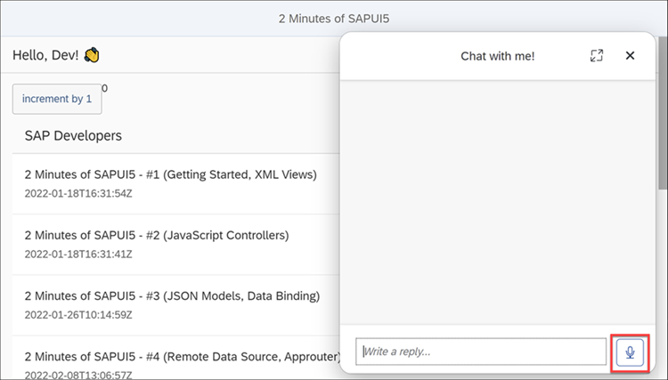
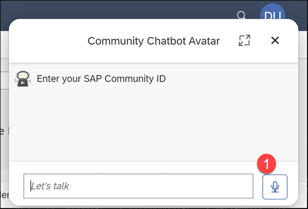
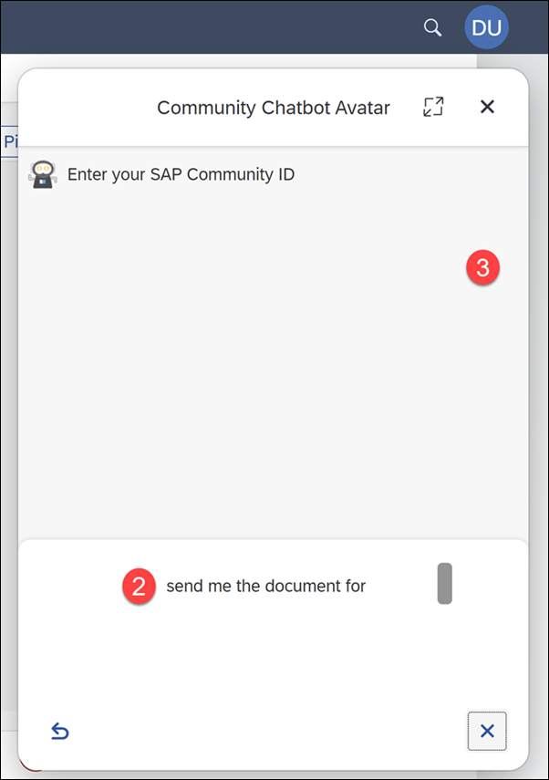
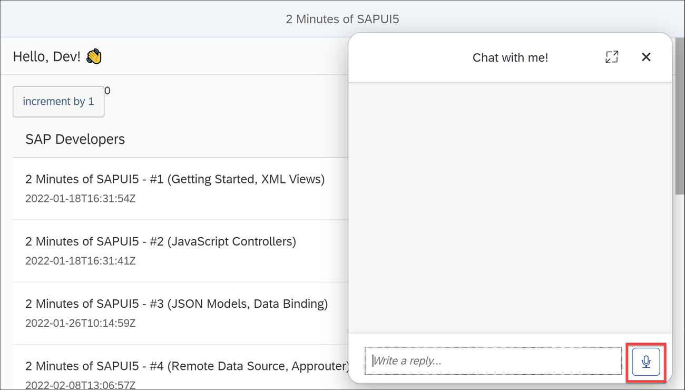
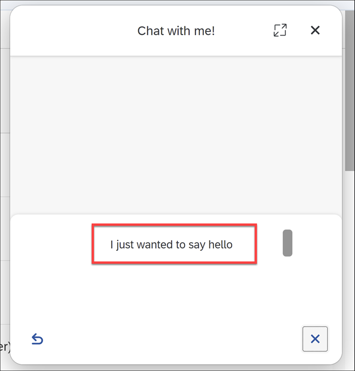
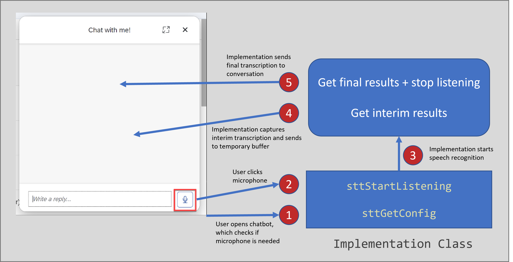

## Prerequisites
 - Any SAPUI5 app (feel free to build the simple SAPUI5 app described in the [2 Minutes of SAPUI5 playlist](https://www.youtube.com/watch?v=J9NMwsipMkw&list=PL6RpkC85SLQC4kuj22e4hw85Sa1pClD8y))
 - An SAP Conversational AI chatbot to deploy in your SAPUI5 app (you can simply use a new one with the Greetings skill)
 - Knowledge on how to deploy a chatbot to a web page with the Web Client. The tutorial [Deploy an SAP Conversational AI Chatbot on a Web Site](conversational-ai-deploy-web) describes a similar process for the Web Chat client.

## Details
### You will learn
  - How to add speech-to-text to your chatbot inside SAPUI5

The speech-to-text capabilities of SAP Conversational AI include:

- Adding a microphone button and capturing the user's click.
- Automatically handling capturing voice from the browser (Media Record)
- Creating a small area to view in real-time the transcription of the voice
- Enabling developers to add the interim transcription to this transcription area
- Adding hooks for, among other events, recognizing when the speech has stopped and adding the transcribed text as a message in the chatbot conversation


&nbsp;

### Ways to implement speech to text

Basically, there are 4 ways to implement speech to text for SAP Conversational AI:

- Without using the speech-to-text features of the chatbot, handling the voice recognition outside the chatbot, and sending a message to the chatbot using the [Web Client APIs](https://github.com/SAPConversationalAI/WebClientDevGuide#sendmessagemessage).
- Using the speech-to-text features, but without the Media Recorder and interim text features.
- **Using the speech-to-text features, but without the Media Recorder feature.**
- Using all the speech-to-text features.

This tutorial will show an example of #3 -- all the features from SAP Conversational AI except that you will manage capturing the audio via the browser, not the chatbot.

>The speech-to-text APIs are documented in the [`SAPConversationalAI / WebClientDevGuide`](https://github.com/SAPConversationalAI/WebClientDevGuide/tree/main/examples/WebClientBridge/stt) GitHub repo.

---

[ACCORDION-BEGIN [Step 1: ](Understand the speech-to-text features)]

The speech-to-text features include displaying a microphone within the chatbot in order to start talking with the bot (1).



SAP Conversational AI lets you capture when a user clicks on the microphone, and lets you start the speech recognition and send interim transcriptions to the temporary transcription area of the chatbot (2).

While talking, the user can either end the session and keep the text or abort and throw away the transcription.

Once the session is over, because the user stopped talking long enough or because the user clicked the microphone button again, the text is sent as an utterance into the conversation. (3)




[DONE]
[ACCORDION-END]

[ACCORDION-BEGIN [Step 2: ](Add Web Client script)]

In your SAPUI5 view controller, in the `onAfterRendering` method, add the script tag for adding your Web Client to a web page. The script is available in the **Connect** tab when developing your chatbot.

```javascript[4-11]
onAfterRendering: function () {
  // Set up chatbot
  // this.renderCAIChatBot()
        let s = document.createElement("script");
        s.setAttribute("src", "https://cdn.cai.tools.sap/webclient/bootstrap.js");
        s.setAttribute("id", "cai-webclient-custom");
        s.setAttribute("data-expander-preferences",data_expander_preferences);
        s.setAttribute("data-channel-id",data_channel_id);
        s.setAttribute("data-token",data_token);
        s.setAttribute("data-expander-type","CAI");
        document.body.appendChild(s);
     },
```

For the specific IDs and tokens for your chatbot, place a new file `webclient.js` inside the `controller` folder (since you may want to change the chatbot from time to time) and add just the following few lines. Make sure to enter values for your chatbot.

```JavaScript[1-3]
const data_expander_preferences = "<my preferences>";
const data_channel_id = "<my channel ID>";
const data_token = "<my token>";
```

To load the file with your details, add a dependency at the start of the controller file.

```JavaScript[14,18]
sap.ui.define([
    "profilePic/controller/BaseController",
    "sap/m/MessageToast",
    "sap/m/MessageBox",
    "sap/ui/core/Core",
    "sap/ui/model/json/JSONModel",
    "sap/ui/Device",
    "sap/suite/ui/commons/library",
    "sap/m/Dialog",
    "sap/m/DialogType",
    "sap/m/Button",
    "sap/m/ButtonType",
    "sap/m/TextArea",
    "./webclient"
],
    function (BaseController, MessageToast, MessageBox, oCore, JSONModel, Device, SuiteLibrary,
        Dialog, DialogType, Button, ButtonType, TextArea,
        webclient) {
```

At this point you should already be able to use the chatbot in your app -- just without speech to text.

Run the SAPUI5 app and use your chatbot.

[DONE]
[ACCORDION-END]


[ACCORDION-BEGIN [Step 3: ](Add base class for speech-to-text functions)]

Create a file called `webclientBridge.js` and add it to your `controller` folder.

Add the following code:

```JavaScript
const webclientBridge = {

    // ALL THE STT METHODS
    //--------------------
    callImplMethod: async (name, ...args) => {
        if (window.webclientBridgeImpl && window.webclientBridgeImpl[name]) {
            return window.webclientBridgeImpl[name](...args)
        }
    },

    // if this function returns an object, WebClient will enable the microphone button and assume STT is enabled.
    sttGetConfig: async (...args) => {
        return webclientBridge.callImplMethod('sttGetConfig', ...args)
    },

    sttStartListening: async (...args) => {
        return webclientBridge.callImplMethod('sttStartListening', ...args)
    },

    sttStopListening: async (...args) => {
        return webclientBridge.callImplMethod('sttStopListening', ...args)
    },

    sttAbort: async (...args) => {
        return webclientBridge.callImplMethod('sttAbort', ...args)
    },

    // only called if useMediaRecorder = true in sttGetConfig
    sttOnFinalAudioData: async (...args) => {
        return webclientBridge.callImplMethod('sttOnFinalAudioData', ...args)
    },

    // only called if useMediaRecorder = true in sttGetConfig
    sttOnInterimAudioData: async (...args) => {
        // send interim blob to STT service
        return webclientBridge.callImplMethod('sttOnInterimAudioData', ...args)
    }
}

window.sapcai = {
    webclientBridge,
}
```

SAP Conversational AI expects these speech-to-text functions in the object `window.sapcai.webclientBridge`.

>This JavaScript code must be loaded before the chatbot is rendered, since the chatbot checks that this file is loaded to determine if the microphone should be displayed.

> You could write your code in a single file. Separating the implementation can help if you will not load the implementation until later.


[DONE]
[ACCORDION-END]

[ACCORDION-BEGIN [Step 4: ](Add implementation)]
For the implementation, we are using a modified and simplified version of the `speech-to-text` npm module located at <https://www.npmjs.com/package/speech-to-text>, which wraps the browser's JavaScript Web Speech API.

Create a file called `webclientBridgeImpl.js` and add it to your `controller` folder.

Add the following code:

```JavaScript
// Handles working with browser speech recognition API
class SpeechToText {
    constructor(onFinalised, onEndEvent, onAnythingSaid) {
        var _this = this;

        var language = arguments.length > 3 && arguments[3] !== undefined ? arguments[3] : 'en-US';

        if (!('webkitSpeechRecognition' in window)) {
            throw new Error("This browser doesn't support speech recognition. Try Google Chrome.");
        }

        var SpeechRecognition = window.webkitSpeechRecognition;
        this.recognition = new SpeechRecognition(); // set interim results to be returned if a callback for it has been passed in

        this.recognition.interimResults = !!onAnythingSaid;
        this.recognition.lang = language;
        var finalTranscript = ''; // process both interim and finalised results

        this.recognition.onresult = function (event) {
            var interimTranscript = ''; // concatenate all the transcribed pieces together (SpeechRecognitionResult)

            for (var i = event.resultIndex; i < event.results.length; i += 1) {
                var transcriptionPiece = event.results[i][0].transcript; // check for a finalised transciption in the cloud

                if (event.results[i].isFinal) {
                    finalTranscript += transcriptionPiece;
                    onFinalised(finalTranscript);
                    finalTranscript = '';
                } else if (_this.recognition.interimResults) {
                    interimTranscript += transcriptionPiece;
                    onAnythingSaid(interimTranscript);
                }
            }
        };

        this.recognition.onend = function () {
            onEndEvent();
        };

        this.startListening = function () {
            this.recognition.start();
        };

        this.stopListening = function () {
            this.recognition.stop();
        };
    }
}

// Contains callbacks for when results are returned
class STTSpeechAPI {
    constructor(language = 'en-US') {
        this.stt = new SpeechToText(this.onFinalResult, this.onStop, this.onInterimResult, language)
    }

    startListening() {
        this.stt.startListening()
    }

    stopListening() {
        this.stt.stopListening()
    }

    abort() {
        this.stt.recognition.abort()
        this.stt.stopListening()
    }

    onFinalResult(text) {
        const m = {
            text,
            final: true,
        }
        window.sap.cai.webclient.onSTTResult(m)
    }

    onInterimResult(text) {
        const m = {
            text,
            final: false,
        }
        window.sap.cai.webclient.onSTTResult(m)
    }

    onStop() {
        const m = {
            text: '',
            final: true,
        }
        window.sap.cai.webclient.onSTTResult(m)
    }
}

// Contains methods SAP Conversational AI needs for handling
// chatbot UI events
let stt = null
const sttSpeech = {
    sttGetConfig: async () => {
         return {
            useMediaRecorder: false,
        }
    },

    sttStartListening: async (params) => {
        const [metadata] = params
        const { language, _ } = metadata

        stt = new STTSpeechAPI(language)
        stt.startListening()
    },

    sttStopListening: () => {
        stt.stopListening()
    },

    sttAbort: () => {
        stt.abort()
    },
}

window.webclientBridgeImpl = sttSpeech
```

[DONE]
[ACCORDION-END]

[ACCORDION-BEGIN [Step 5: ](Add references to JavaScript files)]

The JavaScript files we just added need to be loaded by the app, so we add dependencies in the SAPUI5 view controller to these files, too.

```JavaScript[15-16,20]
sap.ui.define([
    "profilePic/controller/BaseController",
    "sap/m/MessageToast",
    "sap/m/MessageBox",
    "sap/ui/core/Core",
    "sap/ui/model/json/JSONModel",
    "sap/ui/Device",
    "sap/suite/ui/commons/library",
    "sap/m/Dialog",
    "sap/m/DialogType",
    "sap/m/Button",
    "sap/m/ButtonType",
    "sap/m/TextArea",
    "./webclient",
    "./webclientBridge",
    "./webclientBridgeImpl"
],
    function (BaseController, MessageToast, MessageBox, oCore, JSONModel, Device, SuiteLibrary,
        Dialog, DialogType, Button, ButtonType, TextArea,
        webclient,webclientBridge,webclientBridgeImpl) {
```

[DONE]
[ACCORDION-END]

[ACCORDION-BEGIN [Step 6: ](Try out the app)]

The app should be ready to run with speech-to-text in your chatbot.

1. Run the app.

2. Open the chatbot.

    

3. Click the microphone, and allow the browser to use the microphone.

    

4. Say something.

    The text goes in the temporary transcription area, as you say the words:

    

    When you stop talking, the temporary transcription area closes, the full text is transferred to the conversation, and the chatbot answers.

    

[DONE]
[ACCORDION-END]

[ACCORDION-BEGIN [Step 7: ](Understand the flow)]

The way the code is structured, we are basically defining 3 objects:

- `SpeechToText`: The class that handles instantiating and defining callbacks for the browser's speech-to-text capabilities.

- `STTSpeechAPI`: The class that defines a set of callback functions when the `SpeechToText` class receives transcription results or the service starts or stops.

- `sttSpeech`: The object the chatbot calls when, for example, the user clicks the microphone and requests transcription. This object must be located at `window.sapcai.webclientBridge`. When the user clicks the microphone button, this object instantiates the `STTSpeechAPI` class to handle the speech recognition.

Here's the basic flow:



[VALIDATE_1]
[ACCORDION-END]


---
